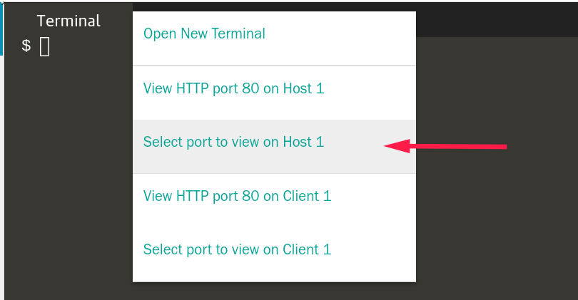

# Enhanced Kubernetes Network Policies with Cilium

## The Promise of Microservices

There are two main benefits of using microservices architecture.

1. Enable distributed teams to work independently on parts of a distributed system, thus making [Conway's Law](https://en.wikipedia.org/wiki/Conway%27s_law) work in our favour.
2. Tame distributed systems complexity by **offloading more and more cross-cutting concerns from application code to the underlying infrastructure.**

In the world where microservices architecture for server side workloads is the dominating paradigm and more and more compute runs on Kubernetes, we have a chance to truly fulfill the microservices technical and organizational promise.

This article will show how to, using Cilium, tackle the authorization concern and move push it to the underlying platform from the application code.

## What is Cilium?

Cilium is an open source software for providing, securing and observing network connectivity between container workloads - cloud native, and fueled by the revolutionary Kernel technology eBPF.
<p style="text-align: center;"><small>Source: https://cilium.io/</small></p>

> If you want to try Cilium yourself, check out their excellent [Interactive Tutorial](https://play.instruqt.com/isovalent/tracks/cilium-getting-started)

### What is eBPF?

> eBPF is a revolutionary technology with origins in the Linux kernel that can run sandboxed programs in an operating system kernel. It is used to safely and efficiently extend the capabilities of the kernel without requiring to change kernel source code or load kernel modules. To learn more about eBPF, visit [Introduction to eBPF](https://ebpf.io/what-is-ebpf/)
<p style="text-align: center;"><small>Source: https://ebpf.io/what-is-ebpf/</small></p>

Here is a [great video](https://www.youtube.com/watch?v=5t7-HM2jlTM&ab_channel=ContainerSolutions) with Liz Rice explaining eBPF in detail.

Below diagram shows how eBPF works on a high level


<p style="text-align: center;"><small>Source: https://ebpf.io/what-is-ebpf</p>

## Granular Authorization Control

Let's imagine a scenario where your REST API consists of multiple endpoints exposing a flight booking related resources. This REST API is deployed to a managed K8s cluster, let's say GKE (Google Kubernetes Engine) and is often accessed by other microservices running in the cluster as well as some external services.

From a security point of view you want to follow [Zero Trust Security](https://en.wikipedia.org/wiki/Zero_trust_security_model) and the [Principle of Least Privilege](https://en.wikipedia.org/wiki/Principle_of_least_privilege) and to achieve this you need to tightly control and verify access to your API and only expose those endpoints that are essential for calling services and not more.

Kubernetes Network Policies can take us half way there.

## Network Policies

Kubernetes [network policies](https://kubernetes.io/docs/concepts/services-networking/network-policies/) define network traffic rules for pods running in a cluster.

Below diagram shows more information about network policies.

> We are going to focus on [Cilium](https://cilium.io/) and show how it can provide enhanced and more powerful policies


However there is one problem. Our flights booking service exposes multiple REST endpoints and Kubernetes Network policies work only on IP:PORT combination. This means that each service running in the cluster will have access to all endpoints even if it doesn't need it. This clearly violates the Principle of least privilege.

## Network Policies Improved

Cilium addresses this issue by introducing a [CRD](https://kubernetes.io/docs/tasks/extend-kubernetes/custom-resources/custom-resource-definitions/) _CiliumNetworkPolicy_ which adds the missing functionality and enables us to decoratively create rules governing access to various endpoints of our API.

> As a side note, from architectural point of view, the same could be achieved with an API Management Gateway such as [KONG](https://konghq.com/kong/), but this is a different approach and works only with HTTP services, whereas Cilium being a lower level solution supports Kafka, Databases and more.

Here is a sample CiliumNetworkPolicy YAML file strictly allowing only traffic from pods with selected labels to use GET verb on the /flights resource.

```yaml
apiVersion: "cilium.io/v2"
kind: CiliumNetworkPolicy
metadata:
  name: "readflights"
spec:
  description: "Allow HTTP GET /flights from env=prod, app=flights_board to app=flights_service"
  endpointSelector:
    matchLabels:
      app: flights_service
  ingress:
  - fromEndpoints:
    - matchLabels:
        env: prod
        app: flights_board
    toPorts:
    - ports:
      - port: "80"
        protocol: TCP
      rules:
        http:
        - method: "GET"
          path: "/flights"
```

Cilium also supports [DNS Policy](https://docs.cilium.io/en/stable/policy/language/#dns-policy-and-ip-discovery) where we can for example allow only incoming external traffic from a load balancer address or pattern matching to a name of service hosted externally.

## What are the benefits

Setting rules on HTTP level (Layer 7) enables offloading of the authorization concerns for APIs to Kubernetes instead of encoding the rules in the application itself.
The benefits of this approach are:

- ability to change the authorization rules independently from application code base development
- possibility to separate application code pipeline from the rules pipeline enabling teams to collaborate
- ability to deploy another instance of the same API in a container image, but with different labels and rules which may depend on namespaces or different conditions
- standardized and centrally controlled security aspect

## Demo Scenario

### Prerequisites

We are going to use a clean Ubuntu 20.04 instance on Katacoda, so no need to install anything locally.

### Steps

### Spin up Katacoda environment

Activate [Ubuntu 20.04 Playground](https://www.katacoda.com/scenario-examples/courses/environment-usages/ubuntu-2004) on Katacoda and follow the steps below.

#### Install k3s on a Ubuntu instance

We are going to use a small and fast Kubernetes distribution from Rancher called [k3s](https://k3s.io/). This will enable us to spin up a fresh Kubernetes cluster very fast and proceed with next steps.

```bash
curl -sfL https://get.k3s.io | INSTALL_K3S_EXEC='--flannel-backend=none --disable-network-policy' sh -
```

Set KUBECONFIG environmental variable to point to k3s config file, so we can talk to the cluster via `kubectl` which is already pre-installed on the Katacoda environment.

```bash
export KUBECONFIG=/etc/rancher/k3s/k3s.yaml
```

#### Install the Cilium CLI

> If you need help installing Cilium, please refer to their [excellent documentation](https://docs.cilium.io/en/stable/gettingstarted/k3s/).

```bash
curl -L --remote-name-all https://github.com/cilium/cilium-cli/releases/latest/download/cilium-linux-amd64.tar.gz{,.sha256sum}
sha256sum --check cilium-linux-amd64.tar.gz.sha256sum
sudo tar xzvfC cilium-linux-amd64.tar.gz /usr/local/bin
rm cilium-linux-amd64.tar.gz{,.sha256sum}

```

#### Install Cilium on the cluster

```bash
cilium install
```

Cilium can take a moment to activate so we will use this command to Wait for Cilium to fully start.

```bash
cilium status --wait
```

#### Deploy sample go API

Let's deploy a minimalistic Go REST API where we can easily test CiliumNetworkPolicy in action.

```bash
kubectl apply -f https://raw.githubusercontent.com/Piotr1215/go-sample-api/master/k8s/deployment.yaml
```

To see the API open port **31234** in the Katacoda terminal



The API has 3 simple GET endpoints

- /           returns "HOME Page"
- /version    returns "VERSION Page"
- /about      returns "ABOUT Page"

#### Check service connectivity

Create a test [BusyBox](https://www.busybox.net/) pod and check connectivity to go-api service

```bash
kubectl run -it --rm debug --image=radial/busyboxplus:curl --restart=Never -- curl -w "\n" http://go-api-svc
```

Let's break down this command:

- `kubectl run` - starts a new pod
- the `-it` flag ensures that we can interact with the pod and send commands to the container running inside
- `--rm` instructs Kubernetes to remove the pod right after it exits
- `curl -w "\n" http://go-api-svc` calls a go-api service taking advantage of Kubernetes DNS and service discovery mechanism

After running this command you should see `HOME Page` returned to the terminal.

#### Apply Network Policy

Let's apply policy that allows only traffic from pods with label app:version_ready to GET endpoint of the go-api pod.

```yaml
apiVersion: "cilium.io/v2"
kind: CiliumNetworkPolicy
metadata:
  name: "readflights"
spec:
  description: "Allow HTTP GET /version from app=version_reader to type=service"
  endpointSelector:
    matchLabels:
      type: service 
  ingress:
  - fromEndpoints:
    - matchLabels:
        app: version_reader
    toPorts:
    - ports:
      - port: "8080"
        protocol: TCP
      rules:
        http:
        - method: "GET"
          path: "/version"
```

```bash
kubectl apply -f https://raw.githubusercontent.com/Piotr1215/go-sample-api/master/k8s/cilium-policy.yaml
```

#### Check if the connectivity works

If our policy works correctly, we shouldn't be able to access the service any longer.

```bash
kubectl run -it --rm debug \
        --image=radial/busyboxplus:curl \
        --restart=Never \
        --timeout=15s \
        -- curl -w "\n" http://go-api-svc
```

The above command will result in a timeout.

> If you don't want to wait for a timeout, you can create a new terminal session with the `+` icon on the top.

### Identity Aware Policy

In order to grant access to a pod to the `/version` endpoint, we have to label it appropriately with `app=version_reader`

```bash
kubectl run -it --rm debug2 \
        --image=radial/busyboxplus:curl \
        --labels app=version_reader \
        --restart=Never \
        -- curl -w "\n" http://go-api-svc/version
```

This should print out `VERSION Page`. Let's try to access the `/about` endpoint from the same pod. Will it work?

```bash
kubectl run -it --rm debug2 \
        --image=radial/busyboxplus:curl \
        --labels app=version_reader \
        --timeout=15s \
        --restart=Never \
        -- curl -w "\n" http://go-api-svc/about
```

## Conclusion

We have just scratched the surface of what Cilium is capable of, but I believe that focusing on a practical use case helps us learn actual skills with Cilium, rather then learning about Cilium.

The current trend with cloud-native ecosystem is to embrace eBPF in more and more scenarios. This technology is currently used by Google, Facebook, SUSE, AWS and many others as a powerful and flexible low level solution that addresses much better set of existing challenges.

Cilium bridges the abstraction gap between low level eBFP primitives and end users and IMO is one of the most promising cloud-native projects.

