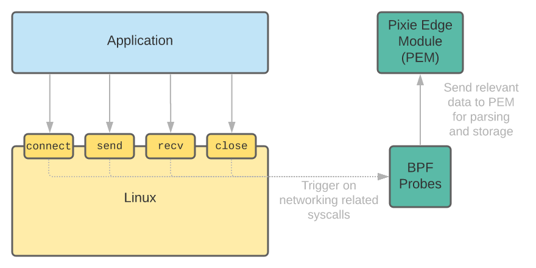

# Kubernetes Networking observability with Cilium

## What is Cilium?

Cilium is an open source software for providing, securing and observing network connectivity between container workloads - cloud native, and fueled by the revolutionary Kernel technology eBPF.

<small>Source: https://cilium.io/</small>

### Cilium Getting Started

[Interactive Tutorial](https://play.instruqt.com/isovalent/tracks/cilium-getting-started)

## What is eBPF?

> eBPF is a revolutionary technology with origins in the Linux kernel that can run sandboxed programs in an operating system kernel. It is used to safely and efficiently extend the capabilities of the kernel without requiring to change kernel source code or load kernel modules. To learn more about eBPF, visit [Introduction to eBPF](https://ebpf.io/what-is-ebpf/)

<small>Source: https://ebpf.io/what-is-ebpf/</small>

Here is a [great video](https://www.youtube.com/watch?v=5t7-HM2jlTM&ab_channel=ContainerSolutions) with Liz Rice explaining eBPF in detail.

Below diagram shows how eBPF works on a high level

<small>Source: Pixie Webpage</small>

## Why problems Cilium solves?

## What are the best use cases for Cilium?

## Where is Cilium used in production?

- Google
- AWS
- Alibaba

